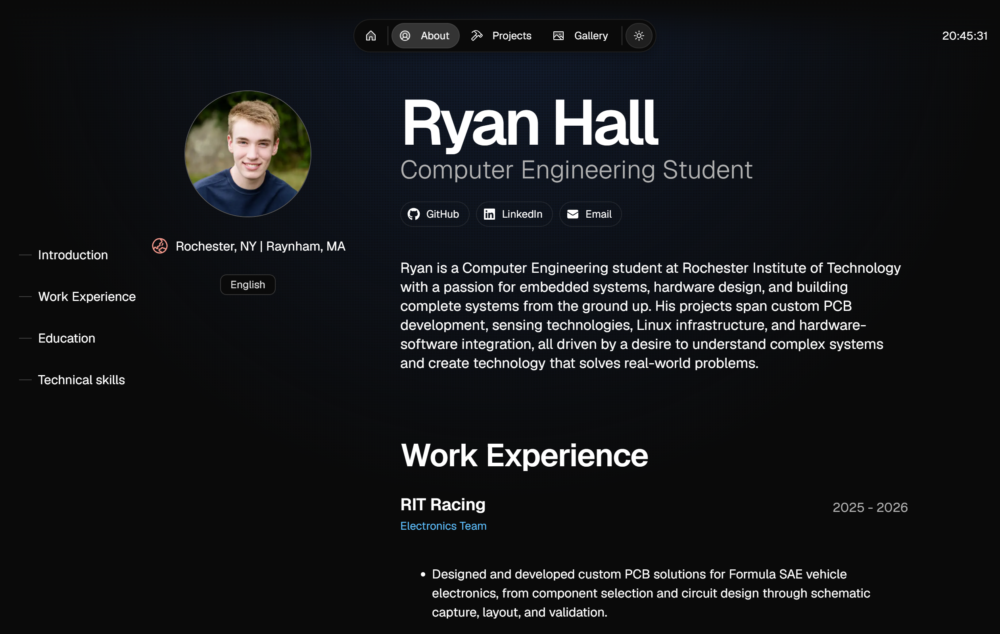

# Ryan Hall's Portfolio (Magic Portfolio Template)

This Portfolio page is adapted from the Magic Portfolio Template. Magic Portfolio is a simple, clean, beginner-friendly portfolio template. It supports an MDX-based content system for projects and blog posts, an about / CV page and a gallery.

## Template Documentation

Docs available at: [docs.once-ui.com](https://docs.once-ui.com/docs/magic-portfolio/quick-start)

## Template Creators

Lorant One: [Threads](https://www.threads.net/@lorant.one) / [LinkedIn](https://www.linkedin.com/in/lorant-one/)

## Template License

Distributed under the CC BY-NC 4.0 License.
- Attribution is required.
- Commercial usage is not allowed.
- You can extend the license to [Dopler CC](https://dopler.app/license) by purchasing a [Once UI Pro](https://once-ui.com/pricing) license.

See `LICENSE.txt` for more information.